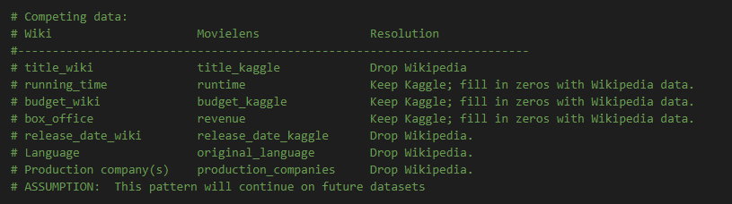

# Movies-ETL

# Week 8 Challenge

## Background
This week's modules went through the ETL process to prepare for a hackathon for a fictitious streaming service, Amazing Prime.  Data was provided in the form of 2 .csv files (Kaggle & ratings data) & 1 .json file (Wiki data).  Data is gathered from both Wikipedia and Kaggle, combined, and saved into a SQL database so that the hackathon participants have a nice, clean dataset to use. 

In this challenge, a Python script was written that performs all three ETL steps on the Wikipedia and Kaggle data.

### Objectives
The goals of this challenge are to:

* Create an automated ETL pipeline.
* Extract data from multiple sources.
* Clean and transform the data automatically using Pandas and regular expressions.
* Load new data into PostgreSQL.

## Resources
Python 3.7
Jupyter Notebook
VS Code
PostgreSQL 11
pgAdmin4
Data:  2 .csv files (Kaggle & ratings data) & 1 .json file (Wiki data)

## Assumptions
1. Future data to run the automated ETL will be provided in the same format .  This includes filenames, file types (2 csv's and 1 json file, no API call), and datatypes inside these files. 
2. The 3 necessary data files are all stored in the same directory as declared in variable file_dir. 
3. Alternate titles only exist in the languages/column names previously reviewed and included in the code.  No new columns added for future data. 
4. Our pattern matches capture almost all of the forms of box office and budget data (currency).  Here we assume only a small percentage will be discarded on future data. 
5. Adult movies will not be considered in this dataset provided for the hackathon. 
6. Future data will follow the same trend where the Kaggle data is more consisent.  That is, we will use the same resolution to combat the data overlap between the Kaggle & Wikipedia data.  See Fig.1 
7. The database and tables have already been set up.  This code will clear values in the existing tables and write in the new data.  

### **Fig.1** 

 